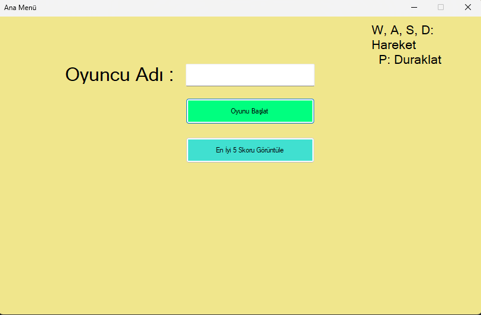
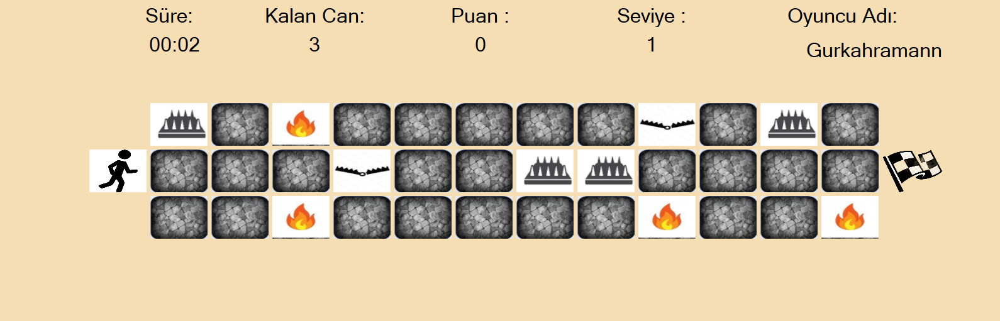
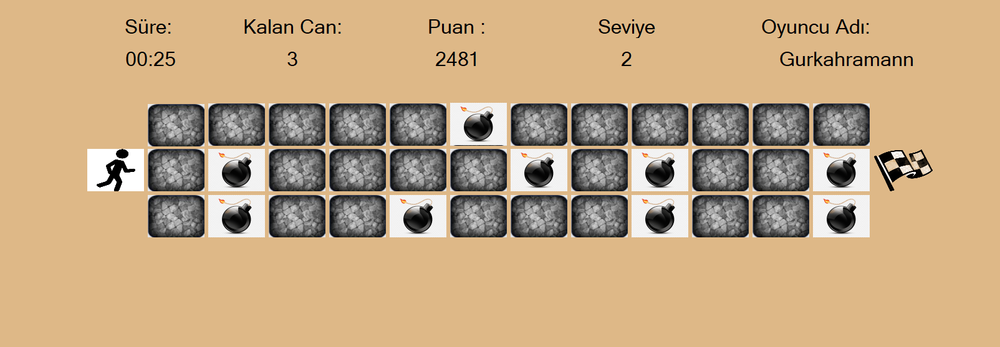
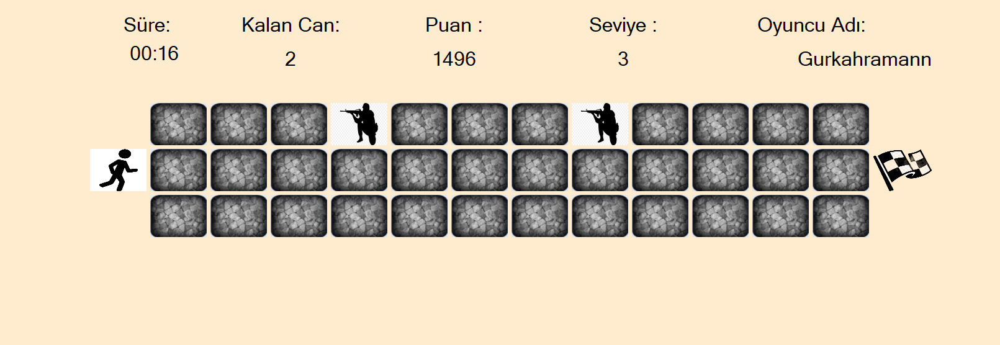
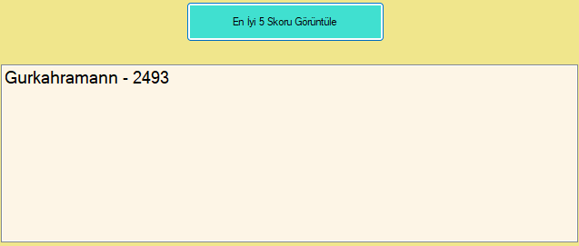

# C# Character Movement Form Application

## Introduction
This project is a C# form application where you can move a character using the W-A-S-D keys, adhering to the principles of object-oriented programming (OOP).

When the program is executed, the Main Menu appears as shown in the image below. In all levels, a mysterious box appears every 10 seconds. This mystery box has an 80% chance of increasing health by 1 and a 20% chance of decreasing it by 1.

## Level Details

### Level 1
After entering a username, the first level appears as shown below, with traps randomly placed in each new game.

### Level 2
In the second level, bombs are dropped randomly onto the game area every 3 seconds.

### Level 3
In the third level, a soldier spawns every 2 seconds and moves one square to the left every second.

## High Scores
Upon successfully completing the game, the top 5 high scores are displayed as follows:

